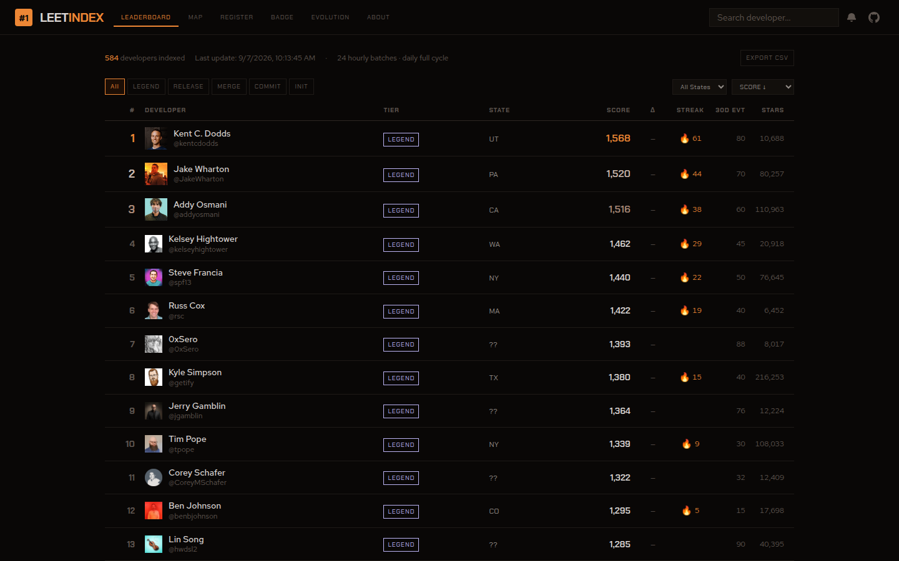

# LeetIndex

**A live, transparent leaderboard for active US-based developers on GitHub.**

[Explore the leaderboard](https://copyleftdev.github.io/leet-index/) · [Check your score](https://copyleftdev.github.io/leet-index/) · [View the scoring model](./score-config.json)

[](https://github.com/copyleftdev/leet-index/actions/workflows/deploy.yml)
[](https://github.com/copyleftdev/leet-index/actions/workflows/update-batch.yml)
[](https://tokentip.to/@copyleftdev)



LeetIndex turns public GitHub signals into a searchable ranking of active developers. Compare recent public activity, repository stars, followers, and public repositories; inspect every score component; follow rank movement; or export the current dataset as CSV. No account is required to browse.

## Why LeetIndex

Most GitHub rankings are lifetime popularity lists. LeetIndex adds recent activity and explicit eligibility gates, so an active builder can compete without already being internet-famous.

- **Transparent scoring** — weights, caps, thresholds, and tier boundaries live in [`score-config.json`](./score-config.json).
- **Activity-aware rankings** — meaningful public events receive up to 500 points with diminishing returns.
- **Useful comparisons** — search profiles and sort by score, activity, followers, stars, or name.
- **Explainable profiles** — expand a developer to see exactly where the score came from.
- **Portable data** — browse without signing in or export the filtered leaderboard as CSV.
- **Profile badges** — generate Markdown, HTML, or reStructuredText badges for a profile README.
- **Automated refreshes** — 24 hourly GitHub Actions batches continuously rebuild and publish the index.

## How scoring works

The current score has a maximum base value of 1,700 points:

| Signal | Points | Calculation |
| --- | ---: | --- |
| Repository stars | 600 | Linear, capped at 5,000 stars |
| Recent activity | 500 | Exponential curve over meaningful events in the last 30 days |
| Followers | 500 | Linear, capped at 3,000 followers |
| Public repositories | 100 | Linear, capped at 200 repositories |

```text
score =
  min(stars / 5000, 1) × 600
  + 500 × (1 − e^(−events_30d / 60))
  + min(followers / 3000, 1) × 500
  + min(public_repos / 200, 1) × 100
```

Accounts younger than 180 days receive a `0.5×` multiplier. The score is an intentionally opinionated measure of visible, public GitHub activity—not a hiring recommendation or a measure of developer ability.

### Tiers

| Tier | Score |
| --- | ---: |
| `INIT` | 0–149 |
| `COMMIT` | 150–349 |
| `MERGE` | 350–699 |
| `RELEASE` | 700–1,199 |
| `LEGEND` | 1,200+ |

## Eligibility

A profile must pass every gate before it can enter the index:

- at least 30 meaningful public events in the last 60 days;
- no inactivity gap longer than 30 days within the observed event window;
- an account at least 30 days old;
- more than 3 public repositories; and
- more than 1 follower.

Meaningful events are public pushes, pull requests, issues, and releases. Coverage depends on GitHub search matching the free-form location on a public profile, so the index is useful but not exhaustive.

## Data pipeline

LeetIndex runs entirely on GitHub-hosted infrastructure:

1. GitHub user search discovers candidate profiles in account-age cohorts.
2. The pipeline fetches public profile, repository, and recent event data.
3. Eligibility gates remove profiles that do not meet the activity threshold.
4. [`score-config.json`](./score-config.json) is applied and ranks are recalculated.
5. [`public/data.json`](./public/data.json) is committed and the React app is deployed to GitHub Pages.

GitHub search and event APIs impose result and history limits. Read the methodology in the app's **About** and **Evolution** views before interpreting the rankings.

## Use the data

The current snapshot is committed as [`public/data.json`](./public/data.json):

```js
const data = await fetch(
  'https://raw.githubusercontent.com/copyleftdev/leet-index/main/public/data.json'
).then((response) => response.json());

console.log(data.generated_at, data.total_indexed);
console.table(data.leaderboard.slice(0, 10));
```

Each leaderboard entry includes its rank, score, tier, public-profile metrics, score breakdown, and batch metadata. The browser UI also provides a one-click CSV export.

## Run locally

Requirements: Node.js 20+ and npm.

```bash
git clone https://github.com/copyleftdev/leet-index.git
cd leet-index
npm ci
npm run dev
```

Build the static site with `npm run build`. To refresh GitHub data locally, provide a token through `GITHUB_TOKEN` and run `npm run fetch:batch -- <0-23>`. Never commit a token.

## Project structure

```text
src/                  React interface
scripts/              discovery, eligibility, scoring, and merge pipeline
public/data.json       published leaderboard snapshot
score-config.json      versioned scoring contract
cloudflare/worker.js   optional live rank and badge endpoints
.github/workflows/     hourly refresh and GitHub Pages deployment
```

## Contributing

Good first contributions include scoring-model tests, location parsing, accessibility improvements, data-quality checks, and clearer methodology. Open an issue before making a scoring change so its effect on existing ranks can be evaluated and documented.

## Privacy and attribution

LeetIndex processes public GitHub profile and activity data. It does not require authentication for browsing and is not affiliated with GitHub, Inc. GitHub is a trademark of GitHub, Inc.
